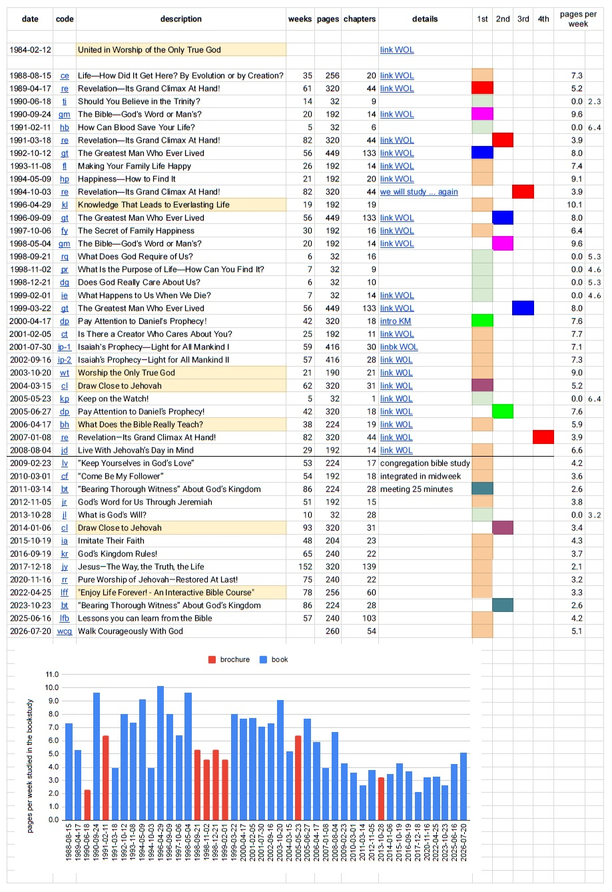

# Buchstudium

Zunächst ein kurzer Überblick über das, was wir im Laufe der Zeit studiert haben, mit einem Link zur Online-Ausgabe der Bücher und dem Studienplan im Königreichsdienst.

## Zeitleiste

| startdate | code | title | pages | chapters | notes |
| --- | --- | --- | --- | --- | --- |
| 2026-07-20 | [wcg](https://wol.jw.org/en/wol/publication/r1/lp-e/wcg) | Walk Courageously With God | 260 | 54  |     |
| 2025-06-16 | [lfb](https://wol.jw.org/en/wol/publication/r1/lp-e/lfb) | Lessons you can learn from the Bible | 240 | 103 |     |
| 2023-10-23 | [bt](https://wol.jw.org/en/wol/publication/r1/lp-e/bt) | “Bearing Thorough Witness” About God’s Kingdom | 224 | 28  |     |
| 2022-04-25 | [lff](https://wol.jw.org/en/wol/publication/r1/lp-e/lff) | "Enjoy Life Forever! - An Interactive Bible Course" | 256 | 60  |     |
| 2020-11-16 | [rr](https://wol.jw.org/en/wol/publication/r1/lp-e/rr) | Pure Worship of Jehovah​—Restored At Last! | 240 | 22  |     |
| 2017-12-18 | [jy](https://wol.jw.org/en/wol/publication/r1/lp-e/jy) | Jesus​—The Way, the Truth, the Life | 320 | 139 |     |
| 2016-09-19 | [kr](https://wol.jw.org/en/wol/publication/r1/lp-e/kr) | God’s Kingdom Rules! | 240 | 22  |     |
| 2015-10-19 | [ia](https://wol.jw.org/en/wol/publication/r1/lp-e/ia) | Imitate Their Faith | 204 | 23  |     |
| 2014-01-06 | [cl](https://wol.jw.org/en/wol/publication/r1/lp-e/cl) | Draw Close to Jehovah | 320 | 31  |     |
| 2013-10-28 | [jl](https://wol.jw.org/en/wol/publication/r1/lp-e/jl) | What is God's Will? | 32  | 28  |     |
| 2012-11-05 | [jr](https://wol.jw.org/en/wol/publication/r1/lp-e/jr) | God’s Word for Us Through Jeremiah | 192 | 15  |     |
| 2011-03-14 | [bt](https://wol.jw.org/en/wol/publication/r1/lp-e/bt) | “Bearing Thorough Witness” About God’s Kingdom | 224 | 28  | meeting 25 minutes |
| 2010-03-01 | [cf](https://wol.jw.org/en/wol/publication/r1/lp-e/cf) | “Come Be My Follower” | 192 | 18  | integrated in midweek |
| 2009-02-23 | [lv](https://wol.jw.org/en/wol/publication/r1/lp-e/lv) | “Keep Yourselves in God’s Love” | 224 | 17  | congregation bible study |
| 2008-08-04 | [jd](https://wol.jw.org/en/wol/publication/r1/lp-e/jd) | Live With Jehovah’s Day in Mind | 192 | 14  | [link WOL](https://wol.jw.org/en/wol/d/r1/lp-e/202008244#h=1:0-35:150) |
| 2007-01-08 | [re](https://wol.jw.org/en/wol/publication/r1/lp-e/re) | Revelation​—Its Grand Climax At Hand! | 320 | 44  | [link WOL](https://wol.jw.org/en/wol/d/r1/lp-e/202006406) |
| 2006-04-17 | [bh](https://wol.jw.org/en/wol/publication/r1/lp-e/bh) | What Does the Bible Really Teach? | 224 | 19  | [link WOL](https://wol.jw.org/en/wol/pc/r1/lp-e/1200271353/38/0) |
| 2005-06-27 | [dp](https://wol.jw.org/en/wol/publication/r1/lp-e/dp) | Pay Attention to Daniel’s Prophecy! | 320 | 18  | [link WOL](https://wol.jw.org/en/wol/d/r1/lp-e/202005165#h=1:0-47:91) |
| 2005-05-23 | [kp](https://wol.jw.org/en/wol/library/r1/lp-e/all-publications/brochures-and-booklets/watch-kp) | Keep on the Watch! | 32  | 1   | [link WOL](https://wol.jw.org/en/wol/d/r1/lp-e/202005128#h=1:0-20:289) |
| 2004-03-15 | [cl](https://wol.jw.org/en/wol/publication/r1/lp-e/cl) | Draw Close to Jehovah | 320 | 31  | [link WOL](https://wol.jw.org/en/wol/d/r1/lp-e/202004047) |
| 2003-10-20 | [wt](https://wol.jw.org/en/wol/publication/r1/lp-e/wt) | Worship the Only True God | 190 | 21  | [link WOL](https://wol.jw.org/en/wol/pc/r1/lp-e/1200271353/64/2) |
| 2002-09-16 | [ip-2](https://wol.jw.org/en/wol/publication/r1/lp-e/ip-2) | Isaiah’s Prophecy​—Light for All Mankind II | 416 | 28  | [link WOL](https://wol.jw.org/en/wol/d/r1/lp-e/202002287#h=1:0-60:31) |
| 2001-07-30 | [ip-1](https://wol.jw.org/en/wol/publication/r1/lp-e/ip-1) | Isaiah’s Prophecy​—Light for All Mankind I | 416 | 30  | [linbk WOL](https://wol.jw.org/en/wol/d/r1/lp-e/202001207#h=1:0-62:30) |
| 2001-02-05 | [ct](https://wol.jw.org/en/wol/publication/r1/lp-e/ct) | Is There a Creator Who Cares About You? | 192 | 11  | [link WOL](https://wol.jw.org/en/wol/d/r1/lp-e/202001005#h=1:0-28:24) |
| 2000-04-17 | [dp](https://wol.jw.org/en/wol/publication/r1/lp-e/dp) | Pay Attention to Daniel’s Prophecy! | 320 | 18  | [intro KM](https://wol.jw.org/en/wol/d/r1/lp-e/202000087#h=1:0-50:74) |
| 1999-03-22 | [gt](https://wol.jw.org/en/wol/publication/r1/lp-e/gt) | The Greatest Man Who Ever Lived | 449 | 133 | [link WOL](https://wol.jw.org/en/wol/pc/r1/lp-e/1200271353/48/0) |
| 1999-02-01 | [ie](https://wol.jw.org/en/wol/library/r1/lp-e/all-publications/brochures-and-booklets/when-we-die-ie) | What Happens to Us When We Die? | 32  | 14  | [link WOL](https://wol.jw.org/en/wol/d/r1/lp-e/201999046) |
| 1998-12-21 | [dg](https://wol.jw.org/en/wol/publication/r1/lp-e/dg) | Does God Really Care About Us? | 32  | 10  |     |
| 1998-11-02 | [pr](https://wol.jw.org/en/wol/publication/r1/lp-e/pr) | What Is the Purpose of Life​—How Can You Find It? | 32  | 9   |     |
| 1998-09-21 | [rq](https://wol.jw.org/en/wol/publication/r1/lp-e/rq) | What Does God Require of Us? | 32  | 16  |     |
| 1998-05-04 | [gm](https://wol.jw.org/en/wol/publication/r1/lp-e/gm) | The Bible​—God’s Word or Man’s? | 192 | 14  | [link WOL](https://wol.jw.org/en/wol/d/r1/lp-e/201998004#h=9:0-9:173) |
| 1997-10-06 | [fy](https://wol.jw.org/en/wol/publication/r1/lp-e/fy) | The Secret of Family Happiness | 192 | 16  | [link WOL](https://wol.jw.org/en/wol/d/r1/lp-e/201997243#h=1:0-5:233) |
| 1996-09-09 | [gt](https://wol.jw.org/en/wol/publication/r1/lp-e/gt) | The Greatest Man Who Ever Lived | 449 | 133 | [link WOL](https://wol.jw.org/en/wol/d/r1/lp-e/201996204#h=3:0-3:186) |
| 1996-04-29 | [kl](https://wol.jw.org/en/wol/publication/r1/lp-e/kl) | Knowledge That Leads to Everlasting Life | 192 | 19  |     |
| 1994-10-03 | [re](https://wol.jw.org/en/wol/publication/r1/lp-e/re) | Revelation​—Its Grand Climax At Hand! | 320 | 44  | [we will study ... again](https://wol.jw.org/en/wol/d/r1/lp-e/201994367#h=1:0-4:504) |
| 1994-05-09 | [hp](https://wol.jw.org/en/wol/publication/r1/lp-e/hp) | Happiness​—How to Find It | 192 | 20  | [link WOL](https://wol.jw.org/en/wol/d/r1/lp-e/201994086#h=5:0-5:150) |
| 1993-11-08 | [fl](https://wol.jw.org/en/wol/publication/r1/lp-e/fl) | Making Your Family Life Happy | 192 | 14  | [link WOL](https://wol.jw.org/en/wol/d/r1/lp-e/201993326#h=4:0-4:152) |
| 1992-10-12 | [gt](https://wol.jw.org/en/wol/publication/r1/lp-e/gt) | The Greatest Man Who Ever Lived | 449 | 133 | [link WOL](https://wol.jw.org/en/wol/d/r1/lp-e/201992321#h=1:0-6:577) |
| 1991-03-18 | [re](https://wol.jw.org/en/wol/publication/r1/lp-e/re) | Revelation​—Its Grand Climax At Hand! | 320 | 44  | [link WOL](https://wol.jw.org/en/wol/d/r1/lp-e/201991006#h=6:281-6:421) |
| 1991-02-11 | [hb](https://wol.jw.org/en/wol/library/r1/lp-e/all-publications/brochures-and-booklets/blood-brochure-hb) | How Can Blood Save Your Life? | 32  | 6   |     |
| 1990-09-24 | [gm](https://wol.jw.org/en/wol/publication/r1/lp-e/gm) | The Bible​—God’s Word or Man’s? | 192 | 14  | [link WOL](https://wol.jw.org/en/wol/d/r1/lp-e/201990288#h=4:0-4:130) |
| 1990-06-18 | [ti](https://wol.jw.org/en/wol/library/r1/lp-e/all-publications/brochures-and-booklets/trinity-ti) | Should You Believe in the Trinity? | 32  | 9   |     |
| 1989-04-17 | [re](https://wol.jw.org/en/wol/publication/r1/lp-e/re) | Revelation​—Its Grand Climax At Hand! | 320 | 44  | [link WOL](https://wol.jw.org/en/wol/d/r1/lp-e/201989132#h=5:0-7:25) |
| 1988-08-15 | [ce](https://wol.jw.org/en/wol/publication/r1/lp-e/ce) | Life​—How Did It Get Here? By Evolution or by Creation? | 256 | 20  | [link WOL](https://wol.jw.org/en/wol/d/r1/lp-e/201988247#h=5:0-5:336) |
| 1984-02-12 |     | United in Worship of the Only True God |     |     | [link WOL](https://wol.jw.org/en/wol/d/r1/lp-e/201984041) |

## Geschichte

I joined the bookstudy in private homes as one hour session in addition to the midweek meeting and weekend meeting in the 1980s. Most of the time we studied a book, but sometimes we also considered a brochure. With opening and closing prayer the time was about 55 minutes. 

In January 2009 we included the bookstudy into the midweek meeting. Before that it was a separate meeting, held in small groups in private homes througout the territory. The midweek meeting stayed at 2 hours, but the **Theocratic Ministry School** and the **Service Meeting** had to be reduced by 25 minutes. See what we studied and how many pages on average ([graph as pdf](docs/bookstudy_graph.pdf)):

**Explanation:** Blue is a book, green is a brochure. The red books are used to support bible studies we conduct. In order to have each publisher be familiar with the current tool we study each part together in our midweek meetings. Some publications have been studied more than once, indicated by a darker blue:

- 4x Revelation​—Its Grand Climax At Hand! (1989, 1991, 1994, 2007)
- 2x The Bible​—God’s Word or Man’s? (1990, 1998)
- 3x The Greatest Man Who Ever Lived (1992, 1996, 1999)
- 2x Pay Attention to Daniel’s Prophecy! (2000, 2005)
- 2x Draw Close to Jehovah (2004, 2014)
- 2x “Bearing Thorough Witness” About God’s Kingdom (2011, 2023)

Here is the link to the pdf:

- [Bookstudy](../docs/bookstudy.pdf)
- [Bookstudy short](../docs/bookstudy_short.pdf)

## New insight

List will follow.

## Organizational changes

Organized by date and source.

- **2025/08** Secular education is personal choice. See update 2025 #5
- **2025/07** Toasting and clinking glasses is a personal choice. See update 2025 #4
- **2024/03** Sisters can wear slacks in the congregation meetings, Brothers don't have to wear a tie. See update 2024 #2 18:07
- **2023/12** Brothers allowed to wear a beard, see update 2023 #8 10:00 as personal decision
- **2023/01** Adjusted hour requirement for pioneers to 600h/year. Auxilary pioneers now 30h/month. Missionaries 100 hours/month. See update 2023 #1
- **2015/01** Adjusted meeting times, now midweek and weekend meeting only 1h45 instead of 2 hours. The additional 15 minutes are intended to spend time with your brothers and sisters. As with 2009 use the extra day for personal study and family worship. See jw.broadcasting November 2014
- **2014/11** SKE **School for Kingdom Evangelizers** replaces "School for Single Brothers" and "School for Christian Couples" SSB and SCC, that itself had replaced MTS Ministry Training School. See jw.broadcasting November 2014
- **2009/01** Bookstudy is included in the midweek meeting with 25 minutes

## Meeting times

After the fall of the Berlin Wall I could join the regular meetings, which were held 3x the week.

### Weekend meeting

This meeting consists of a public talk, the study of the watchtower, and three songs. Average times are 60 minutes for the Watchtower study and 5 minutes per song. Public talks were 45 minutes until December 2014, then shortened to 30 minutes. This reduced the total meeting time from 2 hours to 1h45 from **January 2015** on.

### Midweek meeting

The instructions were published in the **Kingdom Ministry** until December 2015. Since January 2016 we use the **Life and Ministry Meeting Workbook**. Initially it had two parts: The Theocratic Ministry School 

#### The Theocratic Ministry School 

Since 2016 the **midweek meeting** has three main parts: 

- Song, opening prayer - 5 min
- Opening Comments - 1 min (were 3 minutes until December 2019)
- **Treasures from God's Word** - 24 min
- **Apply yourself to the Field Ministry** - 15 minutes
- **Living as Christians** with 1 song, unique 15 min part and 30 min bookstudy - 50 minutes
- Concluding Comments - 3 min
- Song, concluding prayer - 5 min

Total time is about 5 + 1 + 24 + 15 + 50 + 3 + 5 = 103 minutes since January 2020

#### Treasures from God's Word

- 10 minutes Treasures: One specific highlight and application from this weeks bible reading. New books include an introduction
- 10 minutes Digging for Spiritual Gems: (2016- only 8 minutes)
- 4 minutes or less: Bible Reading

#### Apply Yourself to the Field Ministry

Should be 15 minutes. If it is 3 parts with combined 12 minutes (see below) there is 1 minute to change the platform and give a short feedback.

- 15 minutes if it is one big part
- 3 minutes Starting a Conversation
- 4 minutes Follwing up
- 5 minutes talk

#### Living as Christians - 50 min

- 5 minutes song
- 15 minutes unique part, review, Governing Body Update
- 30 minutes: Congregation Bible Study
